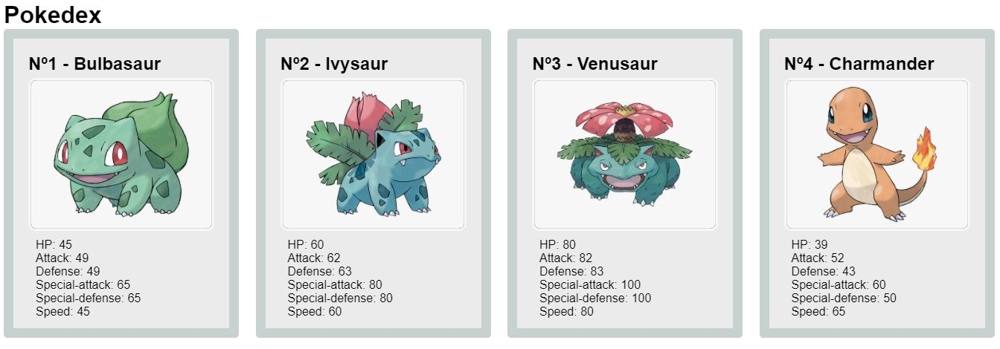

<h1>Desafio Pokemon</h1>

Desafio Pokemon usando a API disponível em: https://pokeapi.co/

<h2>Feito com</h2>
<ul>
    <li>HTML</li>
    <li>CSS</li>
    <li>Javascript</li>
    <li>React</li>
</ul>

<h2>Como usar</h2>

Para iniciar a aplicação basta baixar o repositório, acessar o terminal e digitar o código
<code>npm start</code>

<figure>
    
</figure>